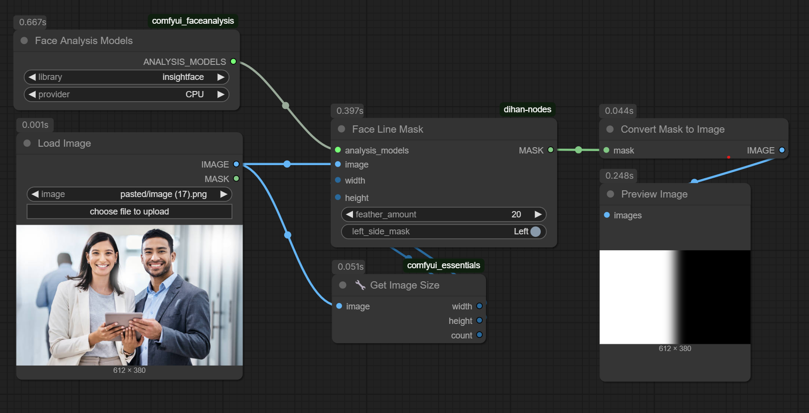

# Face Analysis Nodes for ComfyUI

A collection of specialized nodes for face analysis and manipulation in ComfyUI. This project provides tools for working with facial features and creating masks based on face positions.



## Important Note

This project requires a forked version of [ComfyUI_FaceAnalysis_Advanced](https://github.com/dihan/ComfyUI_FaceAnalysis_Advanced). Please make sure to use this specific fork for compatibility.

## Acknowledgments

This project is inspired by and complements other great ComfyUI extensions, particularly Matteo [ComfyUI InstantID](https://github.com/cubiq/ComfyUI_InstantID) by cubiq. If you're interested in advanced face manipulation and identity preservation, I highly recommend checking out their excellent work.

## Available Nodes

### FaceLineMask

A specialized node that creates a mask based on the positions of two faces in an image. This node is particularly useful for:
- Creating split-face compositions
- Generating masks for face transitions
- Dividing images based on face positions

#### Parameters:

- `analysis_models`: The face analysis models to use for detection
- `image`: Input image to analyze
- `width`: Output mask width (default: 512, max: 8192)
- `height`: Output mask height (default: 512, max: 8192)
- `feather_amount`: Amount of feathering to apply to the mask edge (0-100)
- `mask_side`: Which side to mask (Right/Left)

#### Features:

- Automatically detects face positions
- Creates angled division lines based on face positions
- Supports feathered edges for smooth transitions
- Works with any image resolution up to 8192x8192
- Handles diagonal face arrangements

### FaceDetectionMarker

A node that marks detected faces in an image with bounding boxes. Useful for:
- Visualizing face detection results
- Debugging face detection issues
- Creating annotated images

#### Parameters:

- `analysis_models`: The face analysis models to use for detection
- `image`: Input image to analyze
- `marker_color`: Color of the bounding box (default: red)
- `marker_thickness`: Thickness of the bounding box lines

### FaceGenderDetect

A node that detects the gender of faces in an image. Useful for:
- Gender-based image processing
- Demographic analysis
- Conditional workflows based on gender

#### Parameters:

- `analysis_models`: The face analysis models to use for detection
- `image`: Input image to analyze
- `confidence_threshold`: Minimum confidence for gender detection

### ImageOverlayCompare

A node that overlays two images with adjustable opacity. Useful for:
- Comparing images
- Creating composite visualizations
- Visualizing masks and their effects

#### Parameters:

- `image_a`: Base image
- `image_b`: Overlay image
- `opacity`: Opacity of the overlay (0.0 to 1.0)

#### Features:

- Real-time preview of the overlay
- Adjustable opacity control
- Automatic resizing of overlay to match base image
- Grayscale conversion of overlay for better visualization

## Installation

1. Clone this repository into your ComfyUI custom_nodes directory:
```bash
cd ComfyUI/custom_nodes
git clone [repository-url] dihan-nodes
```

2. Restart ComfyUI

## Usage Examples

### Basic Face Mask Creation
1. Connect your image to the FaceLineMask node
2. Connect your face analysis models
3. Adjust the mask side and feathering as needed
4. Use the resulting mask for image composition or transitions

### Image Overlay Comparison
1. Connect your base image to `image_a`
2. Connect your overlay image to `image_b`
3. Adjust the opacity slider to control the overlay visibility
4. View the result directly in the node preview

### Tips
- For best results, ensure faces are clearly visible in the input image
- Adjust feathering amount based on your desired transition smoothness
- The mask will automatically adjust to face positions regardless of their arrangement
- When using ImageOverlayCompare, try different opacity values to find the best visualization

## Requirements

- ComfyUI
- Python 3.x
- Required Python packages (installed with ComfyUI):
  - torch
  - numpy
  - PIL

## Contributing

Contributions are welcome! Please feel free to submit pull requests or create issues for bugs and feature requests.

## License

MIT License

Copyright (c) 2024 Dihan

Permission is hereby granted, free of charge, to any person obtaining a copy
of this software and associated documentation files (the "Software"), to deal
in the Software without restriction, including without limitation the rights
to use, copy, modify, merge, publish, distribute, sublicense, and/or sell
copies of the Software, and to permit persons to whom the Software is
furnished to do so, subject to the following conditions:

The above copyright notice and this permission notice shall be included in all
copies or substantial portions of the Software.

THE SOFTWARE IS PROVIDED "AS IS", WITHOUT WARRANTY OF ANY KIND, EXPRESS OR
IMPLIED, INCLUDING BUT NOT LIMITED TO THE WARRANTIES OF MERCHANTABILITY,
FITNESS FOR A PARTICULAR PURPOSE AND NONINFRINGEMENT. IN NO EVENT SHALL THE
AUTHORS OR COPYRIGHT HOLDERS BE LIABLE FOR ANY CLAIM, DAMAGES OR OTHER
LIABILITY, WHETHER IN AN ACTION OF CONTRACT, TORT OR OTHERWISE, ARISING FROM,
OUT OF OR IN CONNECTION WITH THE SOFTWARE OR THE USE OR OTHER DEALINGS IN THE
SOFTWARE. 