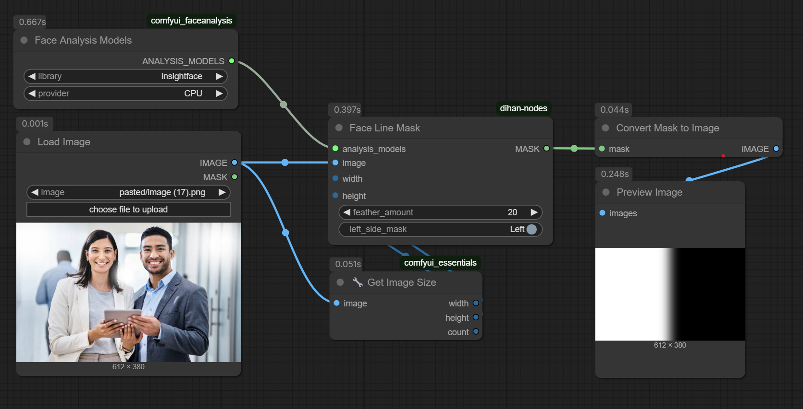

# Face Analysis Nodes for ComfyUI

A collection of specialized nodes for face analysis and manipulation in ComfyUI. This project provides tools for working with facial features and creating masks based on face positions.



## Important Note

This project requires a forked version of [ComfyUI_FaceAnalysis_Advanced](https://github.com/dihan/ComfyUI_FaceAnalysis_Advanced). Please make sure to use this specific fork for compatibility.

## Acknowledgments

This project is inspired by and complements other great ComfyUI extensions, particularly Matteo [ComfyUI InstantID](https://github.com/cubiq/ComfyUI_InstantID) by cubiq. If you're interested in advanced face manipulation and identity preservation, I highly recommend checking out their excellent work.

## Mobile Status Page

This pack also serves a lightweight status dashboard at **`/status`** on ComfyUI's own
web server — no separate process, no port to open. It is a few KB of plain HTML with no
dependencies, so it loads instantly on a phone without pulling in the full ComfyUI
frontend.

The URL follows whatever port you launched ComfyUI with:

| Launch | Status page |
| --- | --- |
| default | `http://<your-ip>:8188/status` |
| `--port 8189` | `http://<your-ip>:8189/status` |

The exact URL is printed to the console on startup:

```
[dihan-nodes] status page: http://<your-ip>:8189/status
```

To reach it from your phone, start ComfyUI with `--listen 0.0.0.0` and use your
machine's LAN IP.

### What it shows

- **Current run** — node being executed (title + class), overall progress, sampler step
  count with ETA, elapsed time, and nodes completed
- **Queue** — how many prompts are pending, plus the running and queued job numbers
- **Resources** — VRAM used/free per device, Torch reserved memory, system RAM
- **Recent runs** — last few prompts with duration and success/error/interrupted status
- **Terminal log** — collapsible tail of ComfyUI's console output
- **Interrupt** — cancel the current run from your phone (tap twice to confirm)

Polling adapts on its own: 1s while a run is active, 3s when idle, 20s when the tab is
backgrounded, so it costs almost nothing to leave open.

### Endpoints

The page is driven by two small JSON endpoints, usable on their own:

- `GET /status/api/snapshot` — everything above in one object
- `GET /status/api/logs?tail=200` — recent console lines

If another extension has already claimed `/status`, this pack falls back to
`/dihan-status` instead of colliding.

## Available Nodes

| Node | Display name | Category | Inputs | Outputs |
|------|--------------|----------|--------|---------|
| `FaceLineMask` | Face Line Mask | `FaceAnalysis` | `ANALYSIS_MODELS`, `IMAGE` | `MASK`, `BOOLEAN` |
| `FaceDetectionMarker` | Face Detection Marker | `FaceAnalysis` | `ANALYSIS_MODELS`, `IMAGE` | `IMAGE` |
| `FaceGenderDetect` | Face Gender Detect | `FaceAnalysis` | `ANALYSIS_MODELS`, `IMAGE` | `IMAGE` |
| `ImageOverlayCompare` | Image Overlay Compare | `image/overlay` | `IMAGE`, `IMAGE` | *(preview only)* |

The three `FaceAnalysis` nodes take an `ANALYSIS_MODELS` input from the
[forked ComfyUI_FaceAnalysis_Advanced](https://github.com/dihan/ComfyUI_FaceAnalysis_Advanced).
`ImageOverlayCompare` is standalone and works with any images.

See [docs/NODES.md](docs/NODES.md) for the full parameter reference.

### FaceLineMask

Creates a mask split along the line between two detected faces. Useful for:
- Split-face compositions
- Face transition masks
- Dividing an image based on where the faces actually are

#### Parameters

| Parameter | Type | Default | Description |
|-----------|------|---------|-------------|
| `analysis_models` | ANALYSIS_MODELS | — | Face analysis models |
| `image` | IMAGE | — | Image to analyze |
| `width` | INT | 512 | Output mask width (1–8192) |
| `height` | INT | 512 | Output mask height (1–8192) |
| `feather_amount` | INT | 0 | Gaussian blur on the mask edge (0–100) |
| `mask_side` | BOOLEAN | Right | Which side of the dividing line to fill |
| `auto_detect_faces` | BOOLEAN | Off | Off = return a fully white mask, skipping detection |
| `auto_detect_gender` | BOOLEAN | Off | Override `mask_side` from the first face's gender |

#### Outputs

| Output | Type | Description |
|--------|------|-------------|
| `MASK` | MASK | Mask tensor, shape `[1, height, width]` |
| `Multiple Faces (Bool)` | BOOLEAN | True when 2+ faces were detected |

#### Behaviour notes

- **`auto_detect_faces` is Off by default**, and Off means the node returns a fully
  white mask without running detection — an easy way to bypass masking in a workflow.
  Turn it On to actually split on face positions.
- Splitting needs **at least two faces**. With Off/one face, the mask stays black.
- `auto_detect_gender` calls `get_gender()` on the first two faces and sets
  `mask_side` to Right when face 1 is female, Left when male. If gender detection
  throws, your manual `mask_side` is kept.
- The dividing line is perpendicular to the line joining the two face centres and
  passes through their midpoint, so any diagonal arrangement works.
- Face coordinates are scaled from the input image to `width`/`height`, and
  `feather_amount` is scaled by the same factor.
- Only the first image of a batch is used.

### FaceDetectionMarker

Draws bounding boxes around every detected face. Useful for:
- Checking what the detector is actually seeing
- Debugging detection and padding before committing to a mask
- Producing annotated reference images

#### Parameters

| Parameter | Type | Default | Description |
|-----------|------|---------|-------------|
| `analysis_models` | ANALYSIS_MODELS | — | Face analysis models |
| `image` | IMAGE | — | Image to analyze |
| `marker_color` | red / green / blue / yellow / white | red | Box colour |
| `line_width` | INT | 2 | Box outline thickness (1–10) |
| `padding` | INT | 0 | Fixed pixels added to each bounding box (0–4096) |
| `padding_percent` | FLOAT | 0.0 | Proportional padding (0.0–2.0, step 0.05) |

#### Features

- Marks **all** detected faces, not just the first two
- Processes the whole batch and returns a batch
- `padding` / `padding_percent` are passed to the detector, so the boxes drawn are
  the same padded boxes a crop node downstream would receive

### FaceGenderDetect

Labels each detected face with its predicted gender. Useful for:
- Verifying gender detection before wiring `auto_detect_gender` in FaceLineMask
- Demographic sorting of a batch
- Conditional workflows

#### Parameters

| Parameter | Type | Default | Description |
|-----------|------|---------|-------------|
| `analysis_models` | ANALYSIS_MODELS | — | Face analysis models |
| `image` | IMAGE | — | Image to analyze |
| `generate_image_overlay` | BOOLEAN | True | Draw the labelled boxes; False passes the image through untouched |

#### Features

- Male faces are boxed in **blue** and labelled `MALE`; female faces in **magenta**
  and labelled `FEMALE`
- Every detection is also logged to the ComfyUI console with its coordinates
- Picks up a 32px system font (DejaVu / Arial / Helvetica depending on platform) and
  falls back to PIL's built-in font if none is found
- Output is always forced back to 3 channels
- Requires `get_gender_locations()`, which exists only in the forked
  FaceAnalysis_Advanced

### ImageOverlayCompare

Composites `image_b` over `image_a` as a translucent white layer, using image_b's
luminance as the alpha. Built for eyeballing a mask against the image it came from.

#### Parameters

| Parameter | Type | Default | Description |
|-----------|------|---------|-------------|
| `image_a` | IMAGE | — | Base image |
| `image_b` | IMAGE | — | Overlay, read as grayscale → alpha |
| `opacity` | FLOAT | 0.5 | Overlay strength (0.0–1.0, step 0.01) |

#### Features

- **Preview only** — this node has no outputs. It extends `PreviewImage`, so the
  result appears in the node itself and nothing is passed downstream.
- Bright areas of `image_b` show as white; dark areas stay transparent. Feed a mask
  into `image_b` to see exactly what it covers.
- `image_b` is auto-resized to `image_a`'s dimensions with nearest-neighbour
  sampling, so mask edges stay crisp rather than being smoothed by the resize.
- Only the first image of a batch is used.
- Lives under the `image/overlay` category, not `FaceAnalysis`.

## Installation

1. Clone this repository into your ComfyUI custom_nodes directory:
```bash
cd ComfyUI/custom_nodes
git clone [repository-url] dihan-nodes
```

2. Restart ComfyUI

## Usage Examples

### Basic Face Mask Creation
1. Connect your image to the FaceLineMask node
2. Connect your face analysis models
3. **Set `auto_detect_faces` to On** — while it is Off the node returns a fully white
   mask and never runs detection
4. Adjust `mask_side` and `feather_amount` as needed
5. Use the resulting mask for image composition or transitions

### Checking Detection Before Masking
1. Run FaceDetectionMarker on the same image first
2. Confirm both faces are boxed, and tune `padding` / `padding_percent`
3. Then wire FaceLineMask with the same models

### Gender-Driven Masking
1. Run FaceGenderDetect to confirm the labels are correct on your image
2. On FaceLineMask, turn on both `auto_detect_faces` and `auto_detect_gender`
3. `mask_side` is now chosen automatically — Right when the first face is female

### Image Overlay Comparison
1. Connect your base image to `image_a`
2. Connect the mask or overlay image to `image_b`
3. Adjust the opacity slider to control the overlay visibility
4. View the result directly in the node preview — this node has no outputs

### Tips
- For best results, ensure faces are clearly visible in the input image
- FaceLineMask needs **two** faces; check `Multiple Faces (Bool)` to branch a workflow
  when only one is found
- Adjust feathering amount based on your desired transition smoothness
- The mask will automatically adjust to face positions regardless of their arrangement
- When using ImageOverlayCompare, try different opacity values to find the best visualization

## Requirements

- ComfyUI
- Python 3.x
- Required Python packages (installed with ComfyUI):
  - torch
  - numpy
  - PIL

## Contributing

Contributions are welcome! Please feel free to submit pull requests or create issues for bugs and feature requests.

## License

MIT License

Copyright (c) 2024 Dihan

Permission is hereby granted, free of charge, to any person obtaining a copy
of this software and associated documentation files (the "Software"), to deal
in the Software without restriction, including without limitation the rights
to use, copy, modify, merge, publish, distribute, sublicense, and/or sell
copies of the Software, and to permit persons to whom the Software is
furnished to do so, subject to the following conditions:

The above copyright notice and this permission notice shall be included in all
copies or substantial portions of the Software.

THE SOFTWARE IS PROVIDED "AS IS", WITHOUT WARRANTY OF ANY KIND, EXPRESS OR
IMPLIED, INCLUDING BUT NOT LIMITED TO THE WARRANTIES OF MERCHANTABILITY,
FITNESS FOR A PARTICULAR PURPOSE AND NONINFRINGEMENT. IN NO EVENT SHALL THE
AUTHORS OR COPYRIGHT HOLDERS BE LIABLE FOR ANY CLAIM, DAMAGES OR OTHER
LIABILITY, WHETHER IN AN ACTION OF CONTRACT, TORT OR OTHERWISE, ARISING FROM,
OUT OF OR IN CONNECTION WITH THE SOFTWARE OR THE USE OR OTHER DEALINGS IN THE
SOFTWARE. 